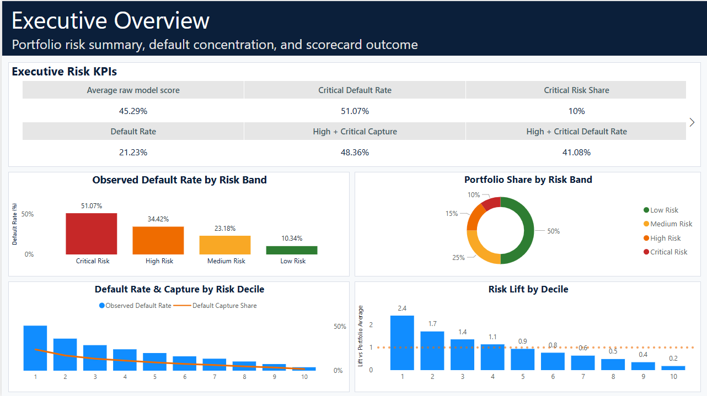
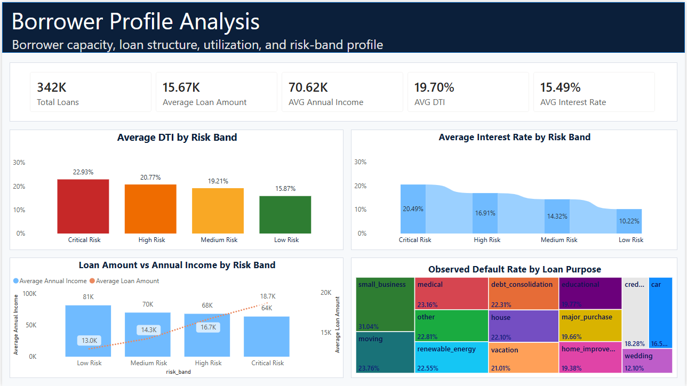
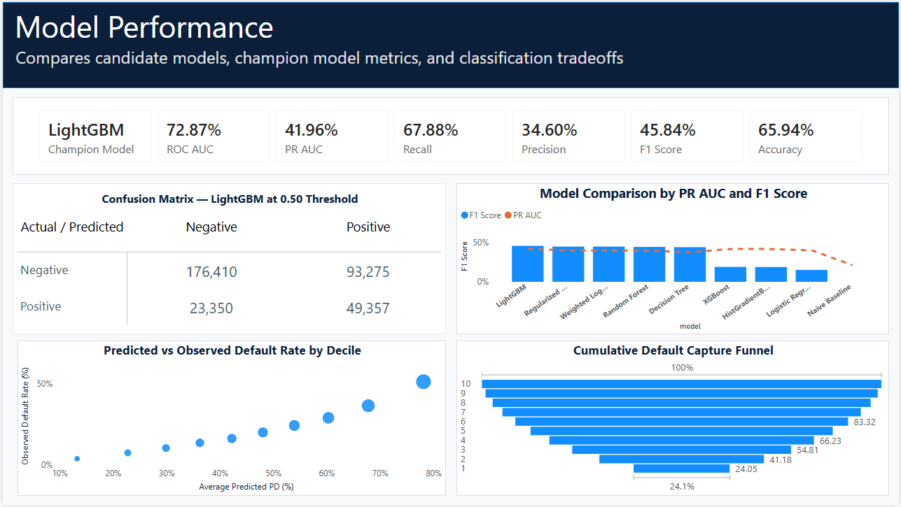
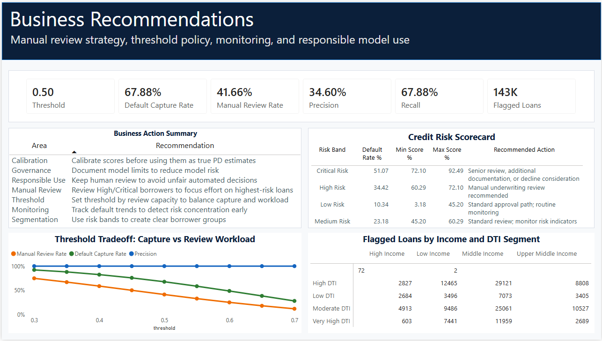

# Loan Default Prediction and Credit Risk Scorecard

##  Project Overview

This project is an end-to-end **loan default prediction and credit risk scorecard** solution built using Python, machine learning, and Power BI.

The objective is to predict borrower default risk, rank loan applicants by model score, segment borrowers into clear risk bands, and convert model outputs into business-ready underwriting recommendations.

The final solution includes:

- Data cleaning and feature engineering
- Machine learning model development and comparison
- Champion model selection
- Threshold tradeoff analysis
- Credit risk scorecard creation
- Borrower risk profile analysis
- Power BI dashboard development
- Business recommendations for manual review and responsible model use

This project demonstrates practical skills in **risk analytics, data analytics, credit risk modeling, machine learning, Power BI reporting, and business decision support**.

---

## Business Problem

Lenders need a structured way to identify borrowers with higher default risk before loan approval or portfolio monitoring decisions are made.

A raw machine learning model score is not enough for business use. The score must be translated into clear and explainable outputs that business users can act on.

This project answers the following questions:

- Which borrowers are most likely to default?
- Which model performs best for loan default prediction?
- How should borrowers be segmented into risk bands?
- Which borrower characteristics are linked with higher risk?
- What threshold should be used for manual review?
- How much manual review workload does the threshold create?
- What business actions should be taken for each risk segment?

---

##  Dataset

The project uses loan-level borrower, credit, income, and repayment data.

Key data fields include:

- Loan amount
- Loan term
- Interest rate
- Installment amount
- Loan grade and sub-grade
- Employment length
- Home ownership
- Annual income
- Verification status
- Loan purpose
- Debt-to-income ratio
- Delinquency history
- Credit inquiry activity
- Revolving balance
- Revolving utilization
- Open accounts
- Total accounts
- Mortgage accounts
- Public records
- Bankruptcy records
- Credit history length

The target variable is:

```text
actual_default
```

This indicates whether the borrower defaulted.

---

## Tools and Technologies

| Area | Tools Used |
|---|---|
| Data processing | Python, Pandas, NumPy |
| Machine learning | Scikit-learn, LightGBM, XGBoost, Random Forest, Logistic Regression |
| Model evaluation | ROC-AUC, PR-AUC, Precision, Recall, F1 Score, Confusion Matrix |
| Risk analytics | Risk bands, scorecard, decile analysis, lift analysis |
| Dashboarding | Power BI |
| Reporting | Markdown, GitHub |
| Version control | Git, GitHub |


##  Model Performance

The champion model achieved the following results:

| Metric | Result |
|---|---:|
| Champion Model | LightGBM |
| ROC-AUC | 72.87% |
| PR-AUC | 41.96% |
| Recall | 67.88% |
| Precision | 34.60% |
| F1 Score | 45.84% |
| Accuracy | 65.94% |

The model showed useful ability to rank borrower default risk and identify a significant share of future defaults.

However, the model should be used as a **decision-support tool**, not as a fully automated approval or rejection system.

---

## 9. Confusion Matrix

At a classification threshold of `0.50`, the champion model produced the following confusion matrix:

| Actual / Predicted | Non-Default | Default |
|---|---:|---:|
| Non-Default | 176,410 | 93,275 |
| Default | 23,350 | 49,357 |

Interpretation:

- **True Negatives:** 176,410 non-default loans correctly classified
- **False Positives:** 93,275 non-default loans flagged for review
- **False Negatives:** 23,350 default loans missed by the model
- **True Positives:** 49,357 default loans correctly captured

This shows a clear tradeoff between default capture and manual review workload.


##  Dashboard Screenshots


```text
dashboard/screenshots/
```

Recommended screenshot names:

```text
01_executive_overview.png
02_model_performance.png
03_borrower_profile_analysis.png
04_business_recommendations.png
```

Markdown references:

```markdown




```


##  Key Results

| Result Area | Outcome |
|---|---:|
| Total scored loans | 342K+ |
| Portfolio default rate | 21.23% |
| Champion model | LightGBM |
| ROC-AUC | 72.87% |
| PR-AUC | 41.96% |
| Recall | 67.88% |
| Precision | 34.60% |
| F1 Score | 45.84% |
| Accuracy | 65.94% |
| Critical Risk default rate | 51.07% |
| High + Critical default capture | 48.36% |
| Policy threshold | 0.50 |
| Manual review rate | 41.66% |
| Default capture rate | 67.88% |


##  Skills Demonstrated

This project demonstrates:

- Data cleaning and preparation
- Feature engineering
- Binary classification modeling
- Model comparison
- Threshold tuning
- Risk segmentation
- Credit scorecard development
- Confusion matrix interpretation
- ROC-AUC and PR-AUC evaluation
- Decile and lift analysis
- Power BI dashboard design
- Business recommendation development
- Responsible AI and model governance awareness
- Translating machine learning outputs into business decision support


##  Final Project Summary

This project converts a machine learning default prediction model into a practical credit risk decision-support solution.

The final output is not just a predictive model. It is a complete business-facing analytics product that includes risk segmentation, scorecard policy, threshold analysis, borrower profile insights, and Power BI reporting.

The solution helps lenders prioritize manual review, monitor portfolio risk, and make more structured credit risk decisions while maintaining the need for human oversight and responsible model governance.
